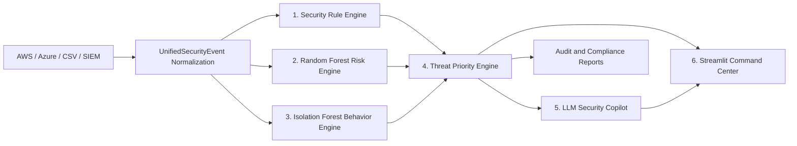

# Security Drift Intelligence Platform

Enterprise security control drift detection for financial services. The platform
combines deterministic security rules, supervised ML, behavioral anomaly
detection, threat prioritization, compliance mapping, multi-cloud ingestion,
GenAI-assisted analysis, and an executive Streamlit dashboard.

## Business Value

- Finds weakened controls across cloud, IAM, firewalls, logging, encryption,
  endpoint security, DLP, and data protection.
- Keeps security severity separate from behavioral rarity, so a familiar
  catastrophic event is never ranked down merely because it is common.
- Reduces false positives using approved-change context and evidence-specific
  rules.
- Produces SOC narratives and audit-ready NIST, CIS, GDPR, and PCI DSS mappings.
- Normalizes AWS, Azure, CSV, and future sources into one event contract.

## Architecture



## Analytical Layers

### 1. Security Rule Engine

Explicit rules cover CloudTrail, MFA, encryption, audit logging, public database
exposure, public firewall access, DLP removal, admin roles, endpoint protection,
and cloud guardrails. Each rule returns a 0-100 score, explanation, business
impact, remediation, and control mappings.

### 2. ML Risk Engine

`RandomForestClassifier` predicts `LOW`, `MEDIUM`, `HIGH`, or `CRITICAL`.
Features include severity, status, change type, control type, compliance impact,
change reason, temporal context, and value-change evidence. Training emits:

- Train/test classification report
- Confusion matrix
- Stratified cross-validation macro F1
- Feature importance
- Probability-weighted `ml_risk_score`

The source dataset has no adjudicated target. The implementation therefore uses
transparent weak labels derived from auditable risk factors. Production should
replace these with closed-case SOC outcomes and approved-change records.

### 3. Behavioral Anomaly Engine

Isolation Forest measures unusual behavior using temporal, control,
compliance, and change-reason features. It deliberately does not use security
severity. Outputs are `anomaly_score`, `anomaly_flag`, and 0-100
`anomaly_confidence`.

### 4. Threat Priority Engine

```text
priority_score =
    0.50 * security_rule_score
  + 0.35 * ml_risk_score
  + 0.15 * anomaly_confidence
```

Mandatory floors keep CloudTrail, MFA, encryption, audit logging, and public
database exposure at critical priority even when behavior is not anomalous.
Critical classification also requires critical rule evidence or critical
unresolved drift.

### 5. Security Copilot

Generates a security summary, business impact, compliance impact, root-cause
hypothesis, remediation, and audit narrative. OpenAI and Gemini are supported.
Without an API key, an evidence-grounded deterministic SOC narrative is used.

### 6. Enterprise Dashboard

The Streamlit command center includes executive metrics, risk distribution,
top alerts, anomaly timeline, threat heatmap, compliance exposure, filters,
alert evidence, Copilot analysis, and model-assurance metrics.

## Project Structure

```text
security-drift-intelligence/
|-- backend/
|   |-- security_rules.py
|   |-- risk_engine.py
|   |-- anomaly_engine.py
|   |-- priority_engine.py
|   |-- validation_engine.py
|   |-- cloudtrail_parser.py
|   |-- azure_parser.py
|   |-- llm_copilot.py
|   `-- pipeline.py
|-- dashboard/streamlit_app.py
|-- data/
|   |-- baseline_configs.json
|   |-- config_drift_events.csv
|   |-- validation_scenarios.csv
|   |-- aws_cloudtrail_mock.json
|   `-- azure_audit_mock.json
|-- models/
|-- notebooks/training.ipynb
|-- reports/audit_reports/
|-- scripts/
|-- tests/
|-- Dockerfile
`-- docker-compose.yml
```

## Quick Start

Tested Windows PowerShell commands on this machine:

```powershell
cd "C:\Users\rishi\OneDrive\Documents\New project\security-drift-intelligence"
& "C:\Users\rishi\Anaconda python\python.exe" -m pip install -r requirements.txt
& "C:\Users\rishi\Anaconda python\python.exe" scripts\run_pipeline.py
& "C:\Users\rishi\Anaconda python\python.exe" -m streamlit run dashboard\streamlit_app.py
```

Open `http://localhost:8501`.

Standard Python 3.11+:

```powershell
python -m venv .venv
.\.venv\Scripts\Activate.ps1
python -m pip install -r requirements.txt
python scripts\run_pipeline.py
python -m streamlit run dashboard\streamlit_app.py
```

Docker:

```bash
docker compose up --build
```

## GenAI Configuration

Create `.env` from `.env.example` and configure one provider:

```text
LLM_PROVIDER=openai
OPENAI_API_KEY=...
OPENAI_MODEL=gpt-4.1-mini
SDI_MODEL_JOBS=1
```

For Gemini, set `LLM_PROVIDER=gemini`, `GEMINI_API_KEY`, and `GEMINI_MODEL`.
Raw payloads are not sent automatically; a call occurs only when an analyst
requests Copilot analysis.

## Generated Outputs

`python scripts/run_pipeline.py` creates:

- `models/random_forest.pkl`
- `models/isolation_forest.pkl`
- Version/schema metadata for safe model loading
- `reports/model_metrics.json`
- `reports/feature_importance.csv`
- `reports/scored_events.csv` and `scored_events.json`
- `reports/normalized_cloud_events.json`
- `reports/validation_results.csv`
- `reports/validation_metrics.json`
- `reports/audit_reports/executive_audit_report.md`
- `reports/audit_reports/compliance_violations.csv`

## Verification

```powershell
& "C:\Users\rishi\Anaconda python\python.exe" -m pytest -q
```

Verified on June 14, 2026:

- 1,004 events scored, including AWS and Azure mock events
- 26/26 validation scenarios passed
- Cross-validation macro F1: 0.771
- 4/4 unit tests passed
- Streamlit test harness: zero application exceptions
- Live Streamlit health endpoint: `ok`
- Dashboard HTTP status: 200
- Docker Compose configuration: valid

## Production Evolution

- Stream through Kafka, Event Hubs, or Kinesis.
- Integrate a CMDB/control graph and change-approval system.
- Replace weak labels with adjudicated SOC outcomes.
- Add SHAP, calibration, model registry governance, and drift monitoring.
- Enforce SSO, RBAC, tenant isolation, encryption, and immutable audit trails.
- Require human approval before automated remediation.
- Export OCSF/ECS alerts to Splunk ES, Sentinel, Cortex, or another SIEM.

The architecture is locally deployable and keeps production control boundaries
explicit rather than presenting a notebook model as a complete security system.
